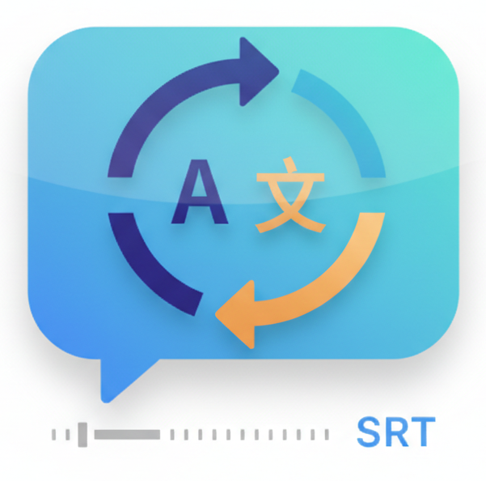

# SRT Translator (SRTtrans)

<p align="center">
  
</p>

AI 기반의 빠르고 정확한 SRT 자막 번역기입니다.  
원본 SRT 파일의 타임스탬프와 구조를 완벽하게 보존하면서 텍스트만 원하는 언어로 번역해 줍니다.

**로컬 AI(Ollama)** 와 **OpenAI 호환 API**를 모두 지원하여 무료로 안전하게 사용할 수 있으며, 사용자 친화적인 웹 UI를 통해 터미널 조작 없이 모든 기능을 제어할 수 있습니다.

---

<p align="center">
  
  
</p>
<p align="center">
  
  
</p>

---

## 주요 기능 (Features)

### 🚀 강력한 번역 및 제어 기능
- 🗂 **다중 파일 일괄 번역**: 여러 개의 SRT 파일을 한 번에 드래그 앤 드롭하여 순차적으로 자동 번역 및 다운로드.
- ⚡ **배치(Batch) 번역**: 여러 줄의 자막을 하나의 API 호출로 묶어 전송하여 번역 속도 극대화. 배치 크기는 Settings에서 조절 가능.
- 🔄 **동시 병렬 처리**: PC 사양이나 API 요금제에 맞춰 동시에 처리할 수를 설정하여 번역 속도 조절. (로컬 AI: 1 권장, OpenAI: 3~10 권장)
- ⏸️ **번역 제어 (Pause & Cancel)**: 무거운 작업 중 시스템 리소스가 필요할 때 언제든 번역을 일시 정지하거나 완전히 취소 가능.
- 🌍 **스마트 언어 선택**: 선택된 AI 모델(qwen2.5, aya 등)이 지원하는 언어 목록을 자동으로 보여주며, 목록에 없는 언어는 직접 입력(Custom) 기능 지원.

### 📊 실시간 모니터링
- 👁 **Live Subtitle Monitor**: 번역 진행 중인 자막과 최근 완료된 자막을 실시간으로 비교 표시하여 번역 품질을 즉시 확인.
- 📈 **이중 프로그레스 바**: 전체 파일 진행률과 개별 파일 내 자막 번역 진행률을 동시 표시.
- 🛡 **Fail-safe 에러 핸들링**: 번역 실패 시 해당 자막은 원본 텍스트를 유지하고 나머지 번역을 속행. 부분 완료된 파일도 다운로드 가능.

### 🤖 내장형 로컬 AI 매니저 (Ollama 연동)
- 📥 **UI 원클릭 모델 설치**: 터미널을 열 필요 없이 웹 화면의 'Setup Guide'에서 클릭 한 번으로 추천 AI 모델 다운로드. (진행률 실시간 표시 및 취소 기능 지원)
- 🔄 **원클릭 모델 스위칭**: 메인 화면 상단에서 현재 내 컴퓨터에 설치된 AI 모델들을 드롭다운으로 확인하고 즉시 변경 가능.
- 🗑 **모델 관리**: 사용하지 않는 무거운 모델을 UI 상에서 바로 삭제하여 디스크 용량 확보.

### ✨ 자막 디테일 최적화
- ⏱ **타임스탬프 보존**: 자막의 싱크가 어긋나지 않도록 완벽하게 구조 유지.
- 📝 **멀티라인 자막 지원**: 한 항목에 2줄 이상의 텍스트가 있는 자막도 안정적으로 처리.
- 🏷 **HTML 태그 보존**: `<i>`, `<b>`, `<font>` 등 자막 서식 태그를 제거한 뒤 번역하고, 번역 결과에 태그를 자동 복원.
- 📄 **스마트 파일명**: 번역이 완료되면 원본 파일명에서 이전 언어 코드를 제거하고 새로운 언어 코드를 붙여 자동 다운로드 (예: `movie.en.srt` → `movie.ko.srt`).
- 📢 **출처 안내문 자동 삽입**: 생성된 자막 파일 최상단(0초~5초 구간)에 사용된 AI 모델 정보 자동 삽입.
- 🛠 **한국어 맞춤법 자동 교정**: 로컬 AI의 고질적인 띄어쓰기 오류(예: `하 다야`, `했어 요`)를 자체 정규식 필터로 자동 교정.
- 🔁 **미번역 자동 감지 & 재시도**: LLM이 원문을 번역하지 않고 그대로 반환한 경우를 감지하여 자동으로 재시도.

### 💾 서버 설정 영구 저장
- ⚙️ Settings에서 변경한 모든 설정(API URL, 모델명, 배치 크기 등)은 서버의 `config.json`에 영구 저장됩니다.
- 다른 브라우저나 시크릿 모드에서 접속해도 동일한 설정이 유지됩니다.
- Setup Guide에서 모델을 다운로드한 후 기본 모델로 설정하면 즉시 반영됩니다.

---

## 기술 스택 (Tech Stack)

| 역할 | 기술 |
|---|---|
| Frontend | Next.js 14 (App Router), React 18, Tailwind CSS 3 |
| Backend | Next.js Route Handlers (API Routes) |
| AI 연동 | OpenAI SDK (Ollama 호환) |
| 아이콘 | Lucide React |
| 테스트 | Vitest |
| 언어 | TypeScript |

---

## 프로젝트 구조

```
src/
├── app/
│   ├── page.tsx                  # 메인 페이지 (오케스트레이터)
│   ├── layout.tsx                # 루트 레이아웃
│   ├── globals.css               # 글로벌 스타일
│   └── api/
│       ├── translate/route.ts    # 번역 API (단일/배치 지원)
│       ├── ollama/route.ts       # Ollama 모델 관리 API
│       └── settings/route.ts     # 서버 설정 읽기/쓰기 API
├── components/
│   ├── FileUploader.tsx          # 드래그 앤 드롭 파일 업로드
│   ├── ModelSelector.tsx         # 모델 선택 드롭다운
│   ├── SettingsModal.tsx         # 설정 모달
│   ├── SetupGuideModal.tsx       # 초기 설정 가이드 모달
│   └── TranslationProgress.tsx   # 진행률 + Live Subtitle Monitor
└── lib/
    ├── types.ts                  # 공용 타입 정의
    ├── constants.ts              # 상수 및 모델별 언어맵
    ├── srt-parser.ts             # SRT 파싱/생성 엔진
    ├── srt-utils.ts              # HTML 태그 유틸리티
    └── __tests__/                # 유닛 테스트 (19개)
        ├── srt-parser.test.ts
        └── srt-utils.test.ts
```

---

## 설치 및 실행 방법 (Getting Started)

### 사전 준비
- [Node.js](https://nodejs.org/) 18 이상
- [Ollama](https://ollama.com/download) (무료 로컬 AI를 사용할 경우)

### 1. 프로젝트 다운로드 및 패키지 설치
```bash
git clone https://github.com/charliehotel/srttrans.git
cd srttrans
npm install
```

### 2. 개발 서버 실행
```bash
npm run dev
```
브라우저에서 `http://localhost:3000` 으로 접속하여 사용합니다.

### 3. 초기 설정
최초 접속 시 우측 상단의 **Setup Guide** 버튼을 눌러 AI 모델을 다운로드하세요.

> **💡 Tip**: `.env.local` 파일을 생성하여 기본값을 미리 설정할 수도 있습니다. 앱이 처음 실행될 때 이 값을 기반으로 `config.json`이 자동 생성됩니다.
> ```env
> OLLAMA_URL="http://127.0.0.1:11434/v1"
> AI_MODEL="qwen2.5:7b"
> ```

---

## 사용 가능한 명령어

| 명령어 | 설명 |
|---|---|
| `npm run dev` | 개발 서버 실행 |
| `npm run build` | 프로덕션 빌드 |
| `npm run start` | 프로덕션 서버 실행 |
| `npm test` | 유닛 테스트 실행 (vitest) |
| `npm run lint` | ESLint 검사 |

---

## 추천 AI 모델

| 모델 | 크기 | 특징 |
|---|---|---|
| **qwen2.5:7b** | 4.7 GB | 한국어 번역 품질 최고, 속도 빠름 **(추천)** |
| aya:8b | 4.8 GB | 다국어 번역 특화 |
| llama3:8b | 4.7 GB | 영어 중심 언어에 안정적 |
| gemma2:9b | 5.5 GB | 구글 최신 모델, 한/일/영 지원 |

위 모델들은 앱의 Setup Guide에서 원클릭으로 다운로드할 수 있습니다.

---

## (Mac 사용자 전용) 바탕화면 바로가기 앱 만들기
동봉된 스크립트를 실행하면 터미널 명령어 입력 없이 클릭 한 번으로 서버 실행부터 브라우저 팝업까지 자동으로 진행되는 Mac 전용 앱(`.app`)을 생성할 수 있습니다.
```bash
chmod +x create-mac-app.sh
./create-mac-app.sh
```

---

## 라이선스 (License)
이 프로젝트는 [MIT License](LICENSE)를 따릅니다. 누구나 자유롭게 사용하고 수정할 수 있습니다!
